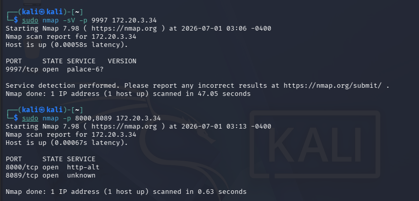
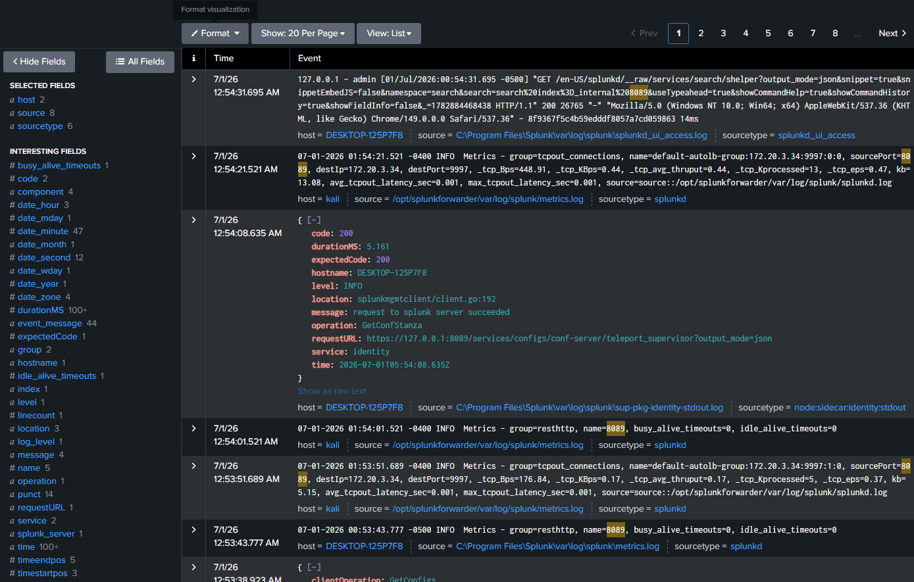

SOC Security Lab: SIEM Infrastructure & Threat Simulation
This project documents the design and implementation of a closed-loop Security Operations Center (SOC) lab environment. The objective was to engineer a functional SIEM (Security Information and Event Management) pipeline capable of ingesting raw system telemetry and validating that data against simulated adversary activity.

Tech Stack:
- Virtualization: Oracle VirtualBox
- Target/Host System: Linux Server
- Attacker/Adversary Host: Kali Linux (Nmap)
- SIEM/Monitoring Platform: Splunk Enterprise
- Log Ingestion: Splunk Universal Forwarder
- Infrastructure Workflow

Environment Architecture:
- The lab was built using a virtualized architecture in VirtualBox, establishing a private network between a hardened Linux target and a centralized Splunk Enterprise server. The configuration ensured isolated network connectivity for the transmission of system and security logs.

Log Pipeline Configuration:
- Splunk Deployment: Provisioned and configured Splunk Enterprise as the central indexer.
- Forwarder Setup: Deployed the Splunk Universal Forwarder on the target Linux host to facilitate log harvesting.
- Ingestion Pipeline: Configured the forwarder to capture real-time system logs, ensuring persistent streaming from the
  host to the SIEM indexer.

Threat Simulation & Methodology:
- To validate the log ingestion pipeline, I performed active reconnaissance against the target Linux host using Kali Linux. The goal was to generate verifiable network connection logs that would traverse the pipeline.

Execution:
- I executed nmap commands targeting specific ports (e.g., 9997, 8000, 8089) to trigger connection responses and service detection events.

Telemetry Analysis & Verification:
- Following the simulation, I accessed the Splunk indexing platform to verify that the reconnaissance events were successfully captured and parsed. By querying the indexed logs, I confirmed that the connection events generated by the Nmap scan were correctly logged and mapped to the source host.

This project provided foundational experience in SIEM engineering, specifically:
- Pipeline Integrity: The necessity of validating that logs are not just being sent, but are correctly indexed and searchable by the SIEM
- Traffic Simulation: Using Nmap to force system state changes allowed for empirical verification of log generation.
- Log Analysis: Moving from raw host-level events to SIEM-indexed data is critical for any SOC workflow.
